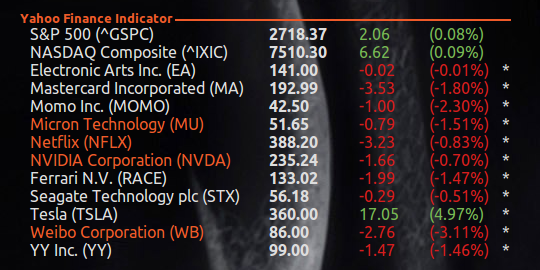

# YahooFinance
Conky Yahoo Finance Indicators



## Run

Just add the next string into your `conky-startup.sh` script
```bash
cd /home/$USER/.conky/YahooFinance
conky -c "/home/$USER/.conky/YahooFinance/yahoo_stock" &
```

## Add new symbols
For add new symbols to conky indicator please use the `stock_yahoo.py` script. This script will update the contents of the `config.json` file
```bash
$ ./stock_yahoo.py -h
usage: stock_yahoo.py [-h] [-s SYMBOL] [-p] [-d DELETE]

optional arguments:
  -h, --help  show this help message and exit
  -s SYMBOL   Symbol
  -p          Purchased status
  -d DELETE   Delete symbol
```

### Structure config.json
```json
{
	"NFLX": {
        "purchased": true,
        "notify": []
    }
}
```

* `NFLX` - Symbol name
* `notify` - List of prices, when reaching which a notification will appear
* `purchased` - Allows you to specify whether the shares of the company are in your portfolio, for greater clarity